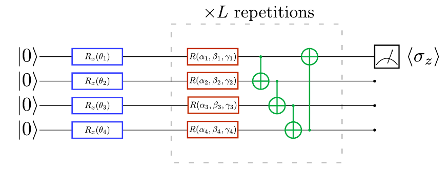
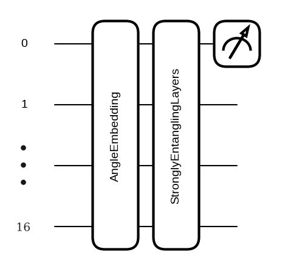
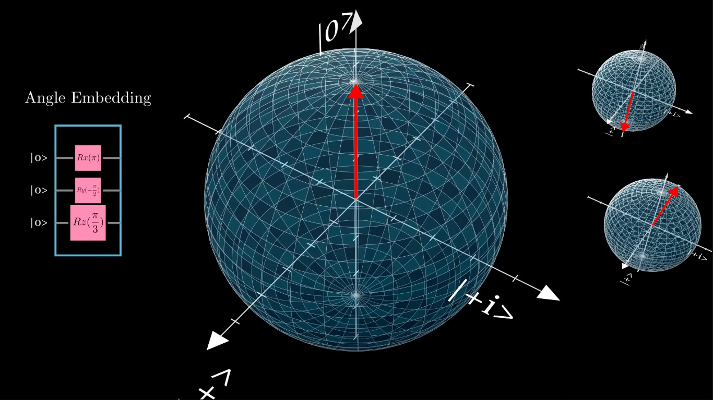
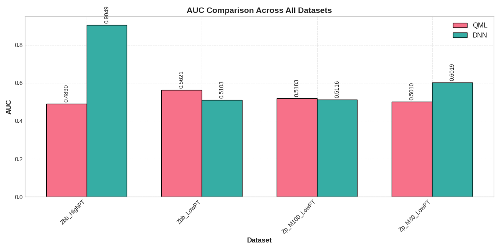
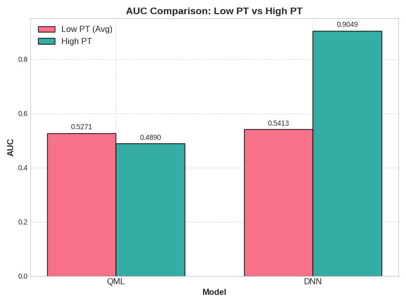
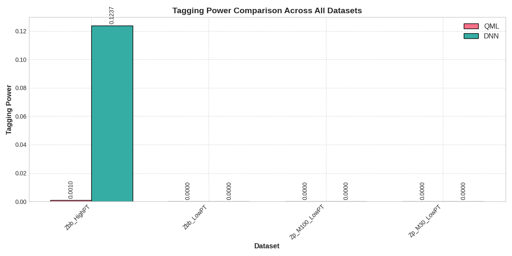
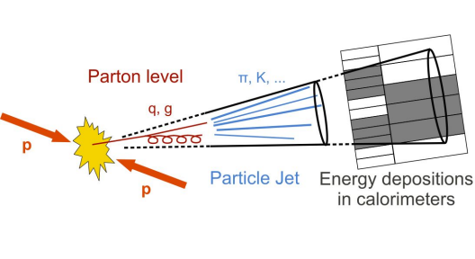
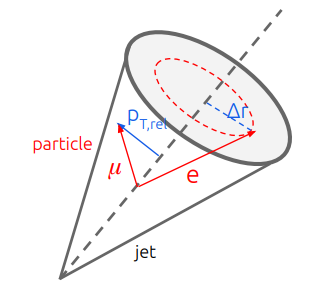
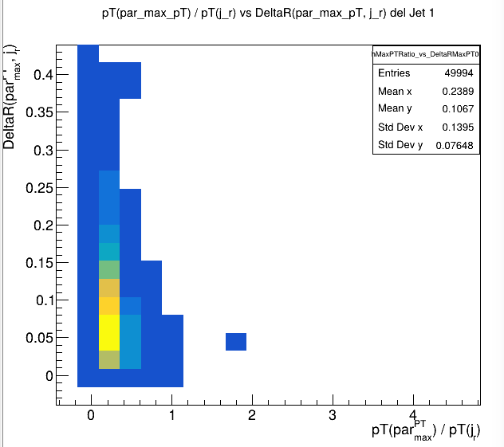
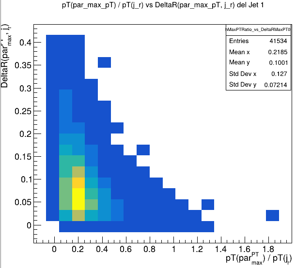

# LowPt-Jet-Qml

Implementación y comparación de técnicas de **Quantum Machine Learning (QML)** con **Machine Learning clásico** para clasificación de jets de bajo momento transverso (b-tagging) en el contexto de experimentos de física de partículas de altas energías.

## Descripción del Proyecto

Este proyecto compara modelos cuánticos (QML con PennyLane y Angle Embedding) y clásicos (DNN con PyTorch) en la tarea de **b-tagging** - clasificación de jets como originados por quarks bottom (b-jets) o no. El estudio se enfoca en jets de **bajo momento transverso** (PT 3-20 GeV), que presentan desafíos únicos en la identificación debido a su menor energía.

### Objetivo Principal

Evaluar la efectividad del Quantum Machine Learning para la identificación de b-jets en rangos de bajo PT, comparando con métodos clásicos mediante métricas de **AUC** y **Tagging Power**.

## Metodología

### Datasets Utilizados

Se utilizan cuatro archivos ROOT con datos de jets en diferentes rangos de PT:

- **Zbb_HighPT**: Jets con PT ≥ 20 GeV (Z → bb̄)
- **Zbb_LowPT**: Jets con PT 3-20 GeV (Z → bb̄)  
- **Zp_M100_LowPT**: Jets con PT 3-20 GeV (Z' masa 100 GeV)
- **Zp_M30_LowPT**: Jets con PT 3-20 GeV (Z' masa 30 GeV)

### Características Extraídas

Se extraen 16 características de histogramas ROOT:
- Número de jets por evento
- Momento transverso promedio del jet
- Número de partículas cargadas
- Distribuciones de ΔR y PT
- Radios R50 y R95 (contención de energía)
- Ratios y correlaciones entre propiedades geométricas

## Quantum Machine Learning

### Angle Embedding



El **Angle Embedding** codifica datos clásicos en qubits mediante rotaciones angulares:

- Para un vector de características **x = [x₁, x₂, ..., x₁₆]** normalizado
- Aplica rotaciones RX(xᵢ) en cada qubit
- 16 características → 16 qubits

### Circuito Cuántico



**Arquitectura del circuito:**
- **Dispositivo**: `lightning.gpu` (16 qubits)
- **Embedding**: `qml.AngleEmbedding`
- **Capas**: 4 `StronglyEntanglingLayers`
- **Medición**: Valor esperado de PauliZ en el primer qubit
- **Salida**: Valores en [-1, 1]

### Representación en la Esfera de Bloch



## Arquitecturas Comparadas

### QML Model
- **16 qubits** (uno por característica)
- **Angle Embedding** para codificación de datos
- **4 capas StronglyEntanglingLayers** para entrelazamiento
- **Optimizador**: Adam (PennyLane)

### DNN Clásica
- **Arquitectura**: 16 → 64 → 32 → 1
- **Activaciones**: ReLU (capas ocultas), tanh (salida)
- **Optimizador**: Adam (PyTorch)

## Resultados

### Comparación de AUC en Todos los Datasets



### Comparación Low PT vs High PT



### Tagging Power por Dataset



### Principales Hallazgos

**Rendimiento por Modelo:**
- **DNN** supera a **QML** en AUC (0.63 vs 0.52) y tagging power
- **HighPT** más fácil de clasificar que **LowPT** (AUC ~0.9 vs ~0.5)
- Jets de **bajo PT** presentan mayor dificultad de separación

**Diferencias por Dataset:**
- **Z normal** vs **Z'**: Las muestras con masas teóricas (Z') distorsionan la distribución
- **QML** muestra potencial en correlaciones complejas pero requiere optimización

## Tecnologías Utilizadas

- **PennyLane**: Framework de Quantum Machine Learning
- **PyTorch**: Deep Learning clásico
- **uproot**: Lectura de archivos ROOT
- **scikit-learn**: Métricas y preprocesamiento
- **CUDA**: Aceleración por GPU (Tesla T4)

## Estructura del Proyecto

```
LowPt-Jet-Qml/
├── README.md
├── requirements.txt
├── LICENSE
├── src/
│   ├── low-pt-qml.ipynb          # Notebook principal
│   ├── final_comparison.txt       # Resultados finales
│   └── *.json, *.zip             # Datos y checkpoints
└── Presentacion/
    ├── LowPtQML.pdf              # Presentación principal  
    ├── LowPtQML.tex              # Código LaTeX
    ├── *.png                     # Figuras e ilustraciones
    └── resumen_hmmm/             # Gráficos de resultados
        ├── auc_all_datasets.png
        ├── auc_low_vs_high_pt.png
        └── tagging_power_all_datasets.png
```

## 🚀 Ejecución

**Nota Importante**: Este notebook fue ejecutado en un entorno Kaggle con acceso a GPU T4. Los archivos en este repositorio son para propósitos expositivos.

### Requisitos
```bash
pip install -r requirements.txt
```

### Principales dependencias:
- `pennylane[lightning-gpu]`
- `torch`  
- `uproot`
- `numpy`
- `matplotlib`
- `scikit-learn`

## Trabajo Futuro

### Limitaciones Identificadas
- **Muestra pequeña** (1000 eventos por dataset)
- **Datos agregados** limitan el aprendizaje detallado
- **Configuración básica** del circuito cuántico

### Próximos Pasos
- Explorar **configuraciones alternativas** del circuito cuántico
- Incorporar **características adicionales** relevantes del jet
- Aumentar el **tamaño de muestra** para mejor estadística
- Implementar **modelos híbridos** cuántico-clásicos

## Referencias

1. A. Gianelle et al., "First implementation of Quantum Machine Learning for b-jet tagging at LHCb", 2021. [[Link]](https://indico.cern.ch/event/1053287/contributions/4442055/attachments/2332563/3975381/qml@lhcb_zuliani.pdf)

2. A. Gianelle et al., "Quantum Machine Learning for b-jet charge identification", 2022. [[arXiv:2202.13943]](https://arxiv.org/pdf/2202.13943)

3. Bloch Sphere, "Quantum Neural Networks explained", 2024. [[Video]](https://youtu.be/xL383DseSpE)


**Juan** - Instituto de Física

---

## 📈 Contexto Físico

### ¿Qué son los Jets?

 

Los jets son colecciones colimadas de partículas producidas en colisiones de alta energía. Su identificación y clasificación son fundamentales para:

- Búsqueda de nueva física
- Estudios del bosón de Higgs  
- Mediciones de precisión del Modelo Estándar

### Desafío de Low PT

 

Los jets de bajo momento transverso presentan:
- **Mayor background** y menor señal
- **Menor separación** entre clases
- **Desafíos computacionales** únicos

Este proyecto explora si las **correlaciones cuánticas** pueden proporcionar ventajas en este régimen desafiante.
